# ToolLab - Detailed Technical Specifications (AGENTS.detail.md)

This document provides deep technical details, schemas, and protocol flows for key features of the **ToolLab** codebase. Refer to these details when modifying database engines, data sync formats, settings, or platform-specific builds.

---

## 1. Bidirectional Cloud Synchronization

The app implements a generic, reusable bidirectional sync architecture that integrates with a Bun-based HTTP cloud server. Rather than hardcoding sync logic for individual tools, the synchronization engine is designed as a generic service that communicates with individual tool databases through a delegate interface.

### 1.1. The Sync Delegate Interface (`SyncDelegate`)

To enable sync on any tool-specific SQLite database table, the tool must implement the `SyncDelegate` interface. This delegate isolates the database storage details from the network operations.

```dart
abstract class SyncDelegate {
  /// Unique identifier of the tool (used to build the sync namespace and toolId on server).
  String get toolId;

  /// Retrieve all local records (active and deleted) as a list of maps.
  /// Each map MUST contain:
  /// - 'id': String (the unique record ID)
  /// - 'updatedAt': int (timestamp in milliseconds)
  /// - 'deleted': bool
  Future<List<Map<String, dynamic>>> getLocalSyncRecords();

  /// Retrieve the full details for a specific local record by ID to push to the server.
  /// Returns a map representing the serialized representation of the record.
  /// This map will be sent in the 'data' field of the push payload.
  /// If the record is deleted, this can return empty map or null.
  Future<Map<String, dynamic>?> getLocalRecordData(String id);

  /// Save a record pulled from the server into the local database.
  /// The [id] is the record's unique ID.
  /// The [data] is the deserialized map containing full details of the record.
  /// The [updatedAt] is the server's update timestamp.
  /// The [deleted] indicates if the record is deleted on the server.
  Future<void> savePulledRecord({
    required String id,
    required Map<String, dynamic> data,
    required int updatedAt,
    required bool deleted,
  });

  /// Permanently delete or mark a record as fully synced locally.
  /// If [wasDeleted] is true, the record was deleted locally and successfully synced to server,
  /// so it can be physically deleted or marked accordingly.
  /// If [wasDeleted] is false, the record was successfully pushed/updated, so it should be marked as synced.
  Future<void> finalizeLocalSync(String id, bool wasDeleted);
}
```

### 1.2. Sync Protocol Flow (`SyncService.sync`)

Synchronization is executed asynchronously inside `AppState` across all active delegates:

```mermaid
sequenceDiagram
    participant AppState as AppState / SyncService
    participant Server as Bun Cloud Server
    
    rect rgb(22, 31, 48)
    Note over AppState,Server: Phase 1: Handshake & Metadata
    AppState->>Server: 1. GET /api/health
    Server-->>AppState: 200 OK (Backend Available)
    AppState->>Server: 2. GET /api/sync/{toolId}/metadata
    Server-->>AppState: JSON metadata (ID, updatedAt, deleted)
    end
    
    rect rgb(30, 41, 59)
    Note over AppState,Server: Phase 2: Resolve Deletions & Delta Pulls
    AppState->>AppState: 3. Retrieve local metadata via delegate.getLocalSyncRecords()
    AppState->>AppState: 4. Identify changed records & apply server deletions
    AppState->>Server: 5. POST /api/sync/{toolId}/pull {ids: [...]}
    Server-->>AppState: JSON full delta records
    AppState->>AppState: 6. Merge pulled records via delegate.savePulledRecord(...)
    end
    
    rect rgb(16, 185, 129)
    Note over AppState,Server: Phase 3: Push Delta Changes
    AppState->>AppState: 7. Fetch full data for records to push via delegate.getLocalRecordData(id)
    AppState->>Server: 8. POST /api/sync/{toolId} {records: [...]}
    Server-->>AppState: 200 success=true
    AppState->>AppState: 9. Finalize local statuses via delegate.finalizeLocalSync(...)
    end
```



### 1.3. Global Settings Persistence
Global sync settings are persisted via `SettingsService` (backed by `SharedPreferences`) under the following keys:
- `sync_enabled`: boolean (whether automated/manual sync is allowed)
- `sync_server_url`: string (base URL of the Bun backend server)
- `sync_user_id`: string (unique identifier or user namespace suffix)
- `sync_last_synced`: int (timestamp of the last successful sync operation)

The global switch is the master: off means no tool syncs, and it owns the server URL and user id.

### 1.3.1. Per-Tool Sync Switch

Each sync-capable tool additionally carries its own switch, so enabling sync globally does not force a heavyweight tool on for someone who only wanted a light one mirrored.

- **Storage**: a per-tool setting, `DatabaseService.setSetting(<tool id>, 'sync_enabled', 'true'|'false')` — the same pattern as `pinned_shortcut` and `drawer_icon`. No new table.
- **Default is on.** A tool with no stored value reads as enabled (`isToolSyncEnabled` returns `true` for a missing key), so a tool that synced before the switch existed keeps syncing after an upgrade. Never write a default value at startup to "fix" this — the absence *is* the default.
- **`AppState` API**: `syncCapableTools` (registry-derived, `syncDelegateFactory != null`), `isToolSyncEnabled(toolId)`, `setToolSyncEnabled(toolId, value)`.
- **UI**: `lib/widgets/tool_sync_switches.dart`, rendered by `sync_settings_page.dart` under the same enabled-gate as the credentials card. It iterates `syncCapableTools`, so a new tool that declares a `syncDelegateFactory` appears with no edit to the widget or the page.

**The gate lives in `AppState.syncWithBackend`**, which filters its argument list down to enabled tools before doing anything, and returns `null` if nothing survives. Every sync path funnels through that method — including the tools that pass their own delegate instance rather than the registered one — so a disabled tool cannot reach the backend by any route. Do not add a second gate elsewhere and do not bypass `syncWithBackend`.

Two behaviours the switch is required to have:

- **Switching off never purges server data.** The tool stops participating; what is already on the backend stays.
- **Switching on clears that tool's `sync_cursor_*` settings.** A cursor promises everything before it was already seen, so tombstones written while the tool was off sit behind it and would be missed forever. Dropping the cursor forces one full metadata pass on the next run.

### 1.4. Unique Record IDs (`shortId`) & Optional User Namespacing

To prevent record duplication and ensure sync stability across multiple platforms (e.g., Flutter and TypeScript):

- **Unique IDs (`shortId`)**:
  - The record's unique ID (`shortId` in camelCase, matching the TypeScript schema) **MUST** be included inside the data map returned by `getLocalRecordData(id)`.
  - When pulling data from the server, if the incoming data payload does not contain the key field (`shortId`), the sync engine or client **MUST** explicitly populate it using the envelope ID (`sRec.id`). This prevents ID loss and eventual duplication of records.
  - When deletes are performed, the client must use the `shortId` to track deletions (rather than local auto-incremented integer keys) so they can be propagated and applied correctly on the server.

- **Optional User Namespacing (`userId`)**:
  - The `userId` setting is optional.
  - If a user ID is specified in settings, the sync engine appends it as a suffix to the request path (e.g., `/api/sync/notes-<userId>`) to isolate user data.
  - If the user ID is left blank or empty, no user ID suffix is appended, and sync operates directly on the raw tool ID (e.g., `/api/sync/notes`). This enables global sharing across tools or platforms that do not use a user namespace.

### 1.5. Binary Data & Blob Handling in Sync

The browser-toolkit backend uses a `__type: 'blob'` wire format to efficiently store binary fields (module files, images, audio) as actual SQLite `BLOB` columns rather than inline base64 text. The Flutter app follows the same convention.

#### 1.5.1. Wire Format

Binary data is wrapped in a tagged object for JSON transport:

```json
{
  "__type": "blob",
  "mimeType": "application/octet-stream",
  "data": "<base64-encoded bytes>"
}
```

#### 1.5.2. Pull Path (Server → Flutter)

1. Server responds with `{__type: 'blob', mimeType, data: '<base64>'}` in the record data.
2. `SyncService._unwrapBlobData()` (in `lib/services/sync_service.dart`) recursively walks the entire data payload **before** passing it to any `SyncDelegate` and converts blob objects to plain base64 strings. This is the central unwrapping — all tools benefit automatically.
3. The delegate's `savePulledRecord()` receives the base64 string, `base64Decode`s it, and stores the raw bytes as a SQLite `BLOB` column.

Tools may also keep a per-tool safety net (`_extractFileData` in `chitone_archive.dart:202`) that handles blob objects independently in case the central unwrap is bypassed.

#### 1.5.3. Push Path (Flutter → Server)

1. The delegate's `getLocalRecordData()` reads raw bytes from the `BLOB` column, `base64Encode`s them, and wraps them in `{__type: 'blob', mimeType, data: '<base64>'}`.
2. The server's `extractAndStoreBlobs()` (`backend/lib/sync-db.ts`) detects the `__type: 'blob'` wrapper, extracts the base64 data into a `sync_binary` table with a real `BLOB` column, and replaces the payload with a `blob_placeholder`.
3. On future pulls, `reconstructBlobs()` converts the placeholder back to the `__type: 'blob'` wire format.

#### 1.5.4. Local Storage — Always BLOB, Never TEXT

Binary fields in tool databases MUST use `BLOB` column affinity, not `TEXT`. Base64 encoding has ~33% storage overhead and adds encode/decode churn on every read/write.

```sql
-- Correct
file_data BLOB NOT NULL

-- Wrong — do not use
file_data TEXT NOT NULL
```

**Reading from BLOB columns:** `sqflite` returns `Uint8List` for BLOB values. Tools must handle legacy `TEXT` rows (from pre-BLOB schemas) as a fallback — see `_dataFromRow()` in `chitone_archive.dart:86`:

```dart
static Uint8List? _dataFromRow(dynamic raw) {
  if (raw is Uint8List) return raw;          // current BLOB
  if (raw is String && raw.isNotEmpty) {     // legacy TEXT (base64)
    return base64Decode(raw);
  }
  return null;
}
```

#### 1.5.5. Migration Path

When switching an existing `TEXT` column to `BLOB`:

1. Bump the `migrate()` version in the tool's `_getDb()`.
2. Create a temp table with the BLOB schema, copy data via `INSERT INTO ... SELECT * FROM ...`, drop the old table, rename the temp table.
3. On read, use the `_dataFromRow` pattern above to handle rows still stored as base64 TEXT before the migration ran.

See `chitone_archive.dart:40-65` for a concrete v1→v2 migration example.

#### 1.5.6. Recovering Corrupted Records

If records were synced before blob handling was implemented, they may have empty `file_data`. The `repairEmptyRecords()` method (see `chitone_archive.dart:98`) detects these by checking for both empty TEXT (`file_data = ''`) and zero-length BLOB (`typeof(file_data) = 'blob' AND length(file_data) = 0`), then hard-deletes them locally. On the next sync the server sees the local record is missing and re-pulls the full record — no delete is propagated to the server.

---

## 2. Database Backup, Export, & File Downloading Specifications

To ensure seamless, crash-free file exporting (e.g., SQLite database copies or settings JSON exports) across different operating systems, leverage `FileSaveHelper` (`lib/helpers/file_save_helper.dart`):

### 2.1. Operating System Implementation Details
- **Desktop (Windows, macOS, Linux)**:
  - Uses `getSaveLocation()` from `package:file_selector` to present a native "Save As" file picker.
  - Prompts the user for a destination path, writes raw bytes directly, and presents a custom in-app success dialog.
- **Mobile (Android)**:
  - Invokes a native Kotlin MethodChannel (`de.renier.tool_lab/file_save`).
  - On Android 10+ (API 29+), uses MediaStore API to write bytes directly into the public Downloads directory without needing runtime storage permissions.
  - Generates a local system-native download completed notification with "Open" and "Share" quick actions.
  - Writes a temporary copy to the cache directory to allow immediate sharing via `share_plus`.
- **iOS & Others**:
  - Writes the backup/export directly to the application documents directory (`getApplicationDocumentsDirectory()`) and displays a success confirmation.

### 2.2. Common API Interface
```dart
Future<String?> FileSaveHelper.saveFile({
  required BuildContext context,
  required String suggestedName,
  Uint8List? bytes,
  List<XTypeGroup>? acceptedTypeGroups,
  String? successMessageAndroid,
  String Function(String displayPath)? successMessageGeneralBuilder,
  String Function(String error)? errorMessageBuilder,
});
```

### 2.3. Sharing Files Natively
To share exported files natively using `share_plus`:
```dart
await SharePlus.instance.share(
  ShareParams(files: [XFile(path, mimeType: mimeType)]),
);
```

### 2.4. Internal Viewer Routing & Popped Navigation
When opening files within the app (e.g. PDF or Markdown), do not navigate using root replacement (`context.go`). Instead, push the viewer route onto the navigation stack (`context.push`) so that back/close navigation naturally pops back to the originating screen (e.g., the notes editor/view).

To support this:
- **Outside Launchers**: Viewer pages (like `PdfViewerPage` and `MarkdownViewerToolPage`) must check if they were opened via a shared file (`widget.sharedFile != null`).
- **Back Actions**: If the file was opened from outside, the back/close button must pop the navigation stack (`Navigator.of(context).pop()`). If opened manually inside the tool, it should clear state (e.g., set file path or content to null) to return to the `FileDropZone`.

### 2.5. Internal Open & Share Choosers
To support unified, cross-platform file opening and sharing (specifically on Desktop where native OS sharing is unsupported or fails), leverage:
- **`FileSaveHelper.showOpenChooser(...)`**: Detects matching tools for a file. If found, displays `ToolChooserDialog` with matching internal tools and a **"System Default App"** option (hiding the "Always use this tool..." checkbox). If none, opens via native system viewer.
- **`FileSaveHelper.showShareChooser(...)`**: Detects matching tools. If found, displays `ToolChooserDialog` with matching internal tools and a **"System Share"** option (hiding the "Always use this tool..." checkbox). If none, opens via native system share sheet.

Always call `FileSaveHelper.showShareChooser` in tool pages (such as NoteCard, PDFViewerPage, and MarkdownViewerPage) when user triggers a share action, rather than calling native share directly.

---

## 3. Gesture, Scroll, & Selection Conflicts in Zoomable Views

This behavior is packaged into the reusable `ZoomableArea` common widget, located at `lib/widgets/zoomable_area.dart`. Always reuse this widget when implementing pinch-to-zoom containers to ensure consistent mobile performance.

When implementing pinch-to-zoom (`GestureDetector` with scale callbacks) on top of scrollable views (`SingleChildScrollView`, `ListView`, etc.) or text selection views (`SelectionArea`, `SelectableText`), gesture recognizer collisions are common on touch devices. This leads to accidental scrolling, jitter, and unexpected text selection highlight handles popping up during pinch-zooming.

### 3.1. Mitigation Strategy (Pointer Absorption & Physics Locking)

To make pinch-to-zoom highly resilient and smooth, the container must bypass standard gesture arena latency by directly listening to raw pointer events and dynamically absorbing pointer propagation:

1. **Raw Pointer Tracking**:
   Use a `Listener` to intercept raw touch pointer events before they enter the gesture arena. Maintain a `Set<int>` of active pointer IDs.
   ```dart
   final Set<int> _activePointers = {};
   ```
   - On `onPointerDown`: Add the pointer ID to `_activePointers`. If `_activePointers.length > 1`, set a pinching state flag `_isPinching = true`.
   - On `onPointerUp` / `onPointerCancel`: Remove the pointer ID. If `_activePointers.isEmpty`, reset `_isPinching = false`.

2. **Pointer Absorption**:
   Wrap the child builder of the zoomable area inside an `AbsorbPointer` widget controlled by the pinching state:
   ```dart
   AbsorbPointer(
     absorbing: _isPinching,
     child: widget.builder(context, scale, physics),
   )
   ```
   This prevents all touch events from reaching the child widgets (such as text selection recognizers or scroll controllers) while a pinch gesture is active, instantly canceling child selection/scroll updates.

3. **Dynamic Scroll Physics Lock**:
   Pass a dynamic `ScrollPhysics` down to the child scroll view. When `_isPinching` (or Ctrl-key scroll wheel zooming on desktop) is active, supply `NeverScrollableScrollPhysics()` to immediately disable scrolling in the viewport:
   ```dart
   final ScrollPhysics? physics = (_ctrlPressed || _isPinching)
       ? const NeverScrollableScrollPhysics()
       : null;
   ```
4. **Clean Reset**:
   When the gesture is ended via `onScaleEnd`, ensure all pointer states are reset and any remaining pointer IDs are cleared to ensure normal user interactivity is immediately restored:
   ```dart
   _activePointers.clear();
   _isPinching = false;
   ```

---

## 4. Tool Folder Structure (`widgets/` subfolder)

Every tool under `lib/tools/<name>/` MUST keep its component widgets inside a `widgets/` subfolder. This is the canonical layout (see also the `creating-a-tool` skill and [`docs/creating-a-tool.md`](docs/creating-a-tool.md)):

```
lib/tools/<name>/
  config.dart              - Tool metadata (ToolModel) only
  <name>_page.dart         - Thin coordinator page (composes widgets, no inline _buildFoo)
  <name>_colors.dart       - Optional tool-specific color palette
  layout_mode.dart, ...    - Non-widget files (enums, models) stay at the tool root
  widgets/                 - REQUIRED home for every tool-specific component widget
    <name>_display.dart
    <name>_toolbar.dart
    <name>_panel.dart
```

Rules:
- Widget files (any `StatelessWidget`/`StatefulWidget` class) ALWAYS live in `widgets/`. Never scatter widget files at the tool root.
- Only `config.dart`, `<name>_page.dart`, the optional `<name>_colors.dart`, and non-widget support files (enums, models, mode definitions) sit directly at the tool root.
- Cross-tool widgets (used by 2+ tools) still belong in the shared `lib/widgets/`, not in any tool's `widgets/`.
- Imports use absolute package paths, e.g. `package:tool_lab/tools/<name>/widgets/<name>_display.dart`.
