# ToolLab - Detailed Technical Specifications (AGENTS.detail.md)

This document provides deep technical details, schemas, and protocol flows for key features of the **ToolLab** codebase. Refer to these details when modifying database engines, data sync formats, settings, or platform-specific builds.

---

## 1. Bidirectional Cloud Synchronization

The app implements a generic, reusable bidirectional sync architecture that integrates with a Bun-based HTTP cloud server. Rather than hardcoding sync logic for individual tools, the synchronization engine is designed as a generic service that communicates with individual tool databases through a delegate interface.

### 1.1. The Sync Delegate Interface (`SyncDelegate`)

To enable sync on any tool-specific SQLite database table, the tool must implement the `SyncDelegate` interface. This delegate isolates the database storage details from the network operations.

```dart
abstract class SyncDelegate {
  /// Unique identifier of the tool (used to build the sync namespace and toolId on server).
  String get toolId;

  /// Retrieve all local records (active and deleted) as a list of maps.
  /// Each map MUST contain:
  /// - 'id': String (the unique record ID)
  /// - 'updatedAt': int (timestamp in milliseconds)
  /// - 'deleted': bool
  Future<List<Map<String, dynamic>>> getLocalSyncRecords();

  /// Retrieve the full details for a specific local record by ID to push to the server.
  /// Returns a map representing the serialized representation of the record.
  /// This map will be sent in the 'data' field of the push payload.
  /// If the record is deleted, this can return empty map or null.
  Future<Map<String, dynamic>?> getLocalRecordData(String id);

  /// Save a record pulled from the server into the local database.
  /// The [id] is the record's unique ID.
  /// The [data] is the deserialized map containing full details of the record.
  /// The [updatedAt] is the server's update timestamp.
  /// The [deleted] indicates if the record is deleted on the server.
  Future<void> savePulledRecord({
    required String id,
    required Map<String, dynamic> data,
    required int updatedAt,
    required bool deleted,
  });

  /// Permanently delete or mark a record as fully synced locally.
  /// If [wasDeleted] is true, the record was deleted locally and successfully synced to server,
  /// so it can be physically deleted or marked accordingly.
  /// If [wasDeleted] is false, the record was successfully pushed/updated, so it should be marked as synced.
  Future<void> finalizeLocalSync(String id, bool wasDeleted);
}
```

### 1.2. Sync Protocol Flow (`SyncService.sync`)

Synchronization is executed asynchronously inside `AppState` across all active delegates:

```mermaid
sequenceDiagram
    participant AppState as AppState / SyncService
    participant Server as Bun Cloud Server
    
    rect rgb(22, 31, 48)
    Note over AppState,Server: Phase 1: Handshake & Metadata
    AppState->>Server: 1. GET /api/health
    Server-->>AppState: 200 OK (Backend Available)
    AppState->>Server: 2. GET /api/sync/{toolId}/metadata
    Server-->>AppState: JSON metadata (ID, updatedAt, deleted)
    end
    
    rect rgb(30, 41, 59)
    Note over AppState,Server: Phase 2: Resolve Deletions & Delta Pulls
    AppState->>AppState: 3. Retrieve local metadata via delegate.getLocalSyncRecords()
    AppState->>AppState: 4. Identify changed records & apply server deletions
    AppState->>Server: 5. POST /api/sync/{toolId}/pull {ids: [...]}
    Server-->>AppState: JSON full delta records
    AppState->>AppState: 6. Merge pulled records via delegate.savePulledRecord(...)
    end
    
    rect rgb(16, 185, 129)
    Note over AppState,Server: Phase 3: Push Delta Changes
    AppState->>AppState: 7. Fetch full data for records to push via delegate.getLocalRecordData(id)
    AppState->>Server: 8. POST /api/sync/{toolId} {records: [...]}
    Server-->>AppState: 200 success=true
    AppState->>AppState: 9. Finalize local statuses via delegate.finalizeLocalSync(...)
    end
```



### 1.3. Global Settings Persistence
Global sync settings are persisted via `SettingsService` (backed by `SharedPreferences`) under the following keys:
- `sync_enabled`: boolean (whether automated/manual sync is allowed)
- `sync_server_url`: string (base URL of the Bun backend server)
- `sync_user_id`: string (unique identifier or user namespace suffix)
- `sync_last_synced`: int (timestamp of the last successful sync operation)

### 1.4. Unique Record IDs (`shortId`) & Optional User Namespacing

To prevent record duplication and ensure sync stability across multiple platforms (e.g., Flutter and TypeScript):

- **Unique IDs (`shortId`)**:
  - The record's unique ID (`shortId` in camelCase, matching the TypeScript schema) **MUST** be included inside the data map returned by `getLocalRecordData(id)`.
  - When pulling data from the server, if the incoming data payload does not contain the key field (`shortId`), the sync engine or client **MUST** explicitly populate it using the envelope ID (`sRec.id`). This prevents ID loss and eventual duplication of records.
  - When deletes are performed, the client must use the `shortId` to track deletions (rather than local auto-incremented integer keys) so they can be propagated and applied correctly on the server.

- **Optional User Namespacing (`userId`)**:
  - The `userId` setting is optional.
  - If a user ID is specified in settings, the sync engine appends it as a suffix to the request path (e.g., `/api/sync/notes-<userId>`) to isolate user data.
  - If the user ID is left blank or empty, no user ID suffix is appended, and sync operates directly on the raw tool ID (e.g., `/api/sync/notes`). This enables global sharing across tools or platforms that do not use a user namespace.

---

## 2. Database Backup, Export, & File Downloading Specifications

To ensure seamless, crash-free file exporting (e.g., SQLite database copies or settings JSON exports) across different operating systems, leverage `FileSaveHelper` (`lib/helpers/file_save_helper.dart`):

### 2.1. Operating System Implementation Details
- **Desktop (Windows, macOS, Linux)**:
  - Uses `getSaveLocation()` from `package:file_selector` to present a native "Save As" file picker.
  - Prompts the user for a destination path, writes raw bytes directly, and presents a custom in-app success dialog.
- **Mobile (Android)**:
  - Invokes a native Kotlin MethodChannel (`de.renier.tool_lab/file_save`).
  - On Android 10+ (API 29+), uses MediaStore API to write bytes directly into the public Downloads directory without needing runtime storage permissions.
  - Generates a local system-native download completed notification with "Open" and "Share" quick actions.
  - Writes a temporary copy to the cache directory to allow immediate sharing via `share_plus`.
- **iOS & Others**:
  - Writes the backup/export directly to the application documents directory (`getApplicationDocumentsDirectory()`) and displays a success confirmation.

### 2.2. Common API Interface
```dart
Future<String?> FileSaveHelper.saveFile({
  required BuildContext context,
  required String suggestedName,
  Uint8List? bytes,
  List<XTypeGroup>? acceptedTypeGroups,
  String? successMessageAndroid,
  String Function(String displayPath)? successMessageGeneralBuilder,
  String Function(String error)? errorMessageBuilder,
});
```

### 2.3. Sharing Files Natively
To share exported files natively using `share_plus`:
```dart
await SharePlus.instance.share(
  ShareParams(files: [XFile(path, mimeType: mimeType)]),
);
```
