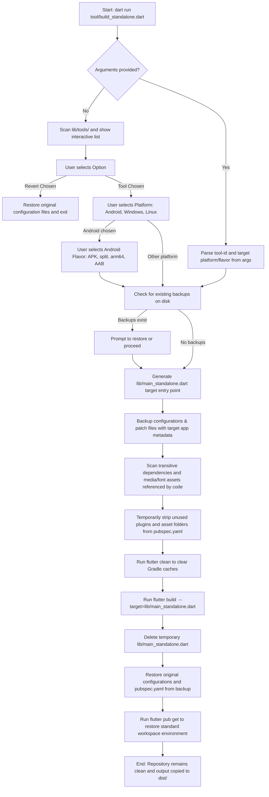

# Standalone Tool Builder

This tool allows you to extract and compile any individual tool from the **ToolLab** workspace into a lightweight, standalone Android, Windows, or Linux application with zero manual code modifications.

---

## How It Works & Workflow

Here is the visual workflow of the building process:



### Key Mechanisms:
1. **Tool Isolation Patching**: The script temporarily rewrites `lib/core/tool_registry.dart` to contain **only** the config of the targeted tool. This breaks the circular import graph that originally dragged in all 29 tools (via `AppState` and `SharingService`), unlocking true Dart tree-shaking!
2. **Font & Code Tree-Shaking**: Any unreferenced icons and code elements of other tools are eliminated (e.g. MaterialIcons is tree-shaken from 1.6MB down to 2.2KB!).
3. **Dynamic Dependency Stripping**: The build script recursively scans all imports starting from `main_standalone.dart` down through the tool configuration. It detects only the third-party plugins in use and comments out all other unused plugins from `pubspec.yaml` (removing Tensorflow models in `google_mlkit`, audio libs in `flutter_soloud`, etc.).
4. **Dynamic Asset Stripping**: It scans the code of the visited files for references to asset directories (`assets/audio/`, `assets/google_fonts/`, `assets/grammars/`) and comments out unused paths in `pubspec.yaml`. This completely excludes the **21MB+** audio folder and the **9.8MB** emoji font file.
5. **Gradle Cache Clearing**: The script automatically executes `flutter clean` prior to compilation, forcing Gradle to reconstruct the native compile inputs using only the active dependencies. This successfully drops the `bubble-level` standalone arm64 APK from **85.4MB** down to **25.4MB**!
6. **Metadata & Title Patching**: App identifiers (package names), launcher names, window titles, and binary names are dynamically swapped for Android, Windows, and Linux configurations during compilation.
7. **Automatic Cleanups**: Once compiled, the builder cleans up generated files, restores the codebase config files to their initial state, and runs `flutter pub get` to restore the package config.

---

## Safety & Workspace Recovery

To prevent accidental changes from leaking into git commits (or in case the builder is aborted prematurely):
*   **Git Ignored Entry Point**: `/lib/main_standalone.dart` is added to the project `.gitignore` so it is never tracked.
*   **Disk-Based Backups**: Original configurations are copied to `.agents/temp/standalone_backup/` before editing.
*   **Interactive Menu Option**: The very first selection option in the interactive builder tool menu is `[Restore Backups / Revert Workspace Changes]` for easy one-click manual cleanup.
*   **Automatic Restore Prompt**: If you re-run the builder after an aborted compile, it detects the pending backups and offers to restore the codebase automatically.
*   **OS-level Signal Catching**: Listens to Ctrl+C at the OS level (via `ProcessSignal.sigint`) to restore files and reset terminal settings immediately.
*   **Manual Recovery**: You can manually revert the repository back to normal at any time by running:
    ```bash
    dart run tool/build_standalone.dart --restore
    ```

---

## Usage

### 1. Interactive Menu Mode
Simply run the runner script without any arguments:
```bash
dart run tool/build_standalone.dart
```
This launches a premium terminal selection menu. If running inside an IDE run config or non-TTY shell, it automatically falls back to a clean numeric input menu.

### 2. Direct CLI Command Mode
Build directly by passing the tool-id and target platform/flavor:
```bash
# syntax: dart run tool/build_standalone.dart <tool-id> [target]
dart run tool/build_standalone.dart sound-finder android-apk     # Universal APK
dart run tool/build_standalone.dart sound-finder android-split   # Split APKs per ABI
dart run tool/build_standalone.dart sound-finder android-arm64   # arm64-only APK
dart run tool/build_standalone.dart sound-finder android-bundle  # App Bundle (AAB)
dart run tool/build_standalone.dart sound-finder windows         # Windows Desktop
dart run tool/build_standalone.dart sound-finder linux           # Linux Desktop
```
*(If target is omitted, it defaults to `android-apk`)*

---

## Standalone Output Locations

Final compiled binaries/executable directories are moved to the `/dist` folder with appropriate names (retaining the app version from `pubspec.yaml`):

*   **Android (APK/AAB)**:
    *   Universal: `dist/<tool-id>-v<version>-release.apk`
    *   ABI-split: `dist/<tool-id>-v<version>-<abi>-release.apk`
    *   App Bundle: `dist/<tool-id>-v<version>-release.aab`
*   **Windows (Desktop)**: `dist/<tool_folder>-v<version>-windows/`
*   **Linux (Desktop)**: `dist/<tool_folder>-v<version>-linux/`

---

## File Structure

```
tool/standalone_builder/
  bin/
    main.dart           # CLI Entrypoint, processes arguments & prompts
  src/
    builder.dart        # Coordinates main standalone compilation & cleanup
    config_patcher.dart # Platform-specific search-and-replace patching logic
    tools_scanner.dart  # Automatic discovery of tool configs under lib/tools/
    tui/                # Self-contained terminal UI (no third-party deps)
      ansi.dart         # ANSI color / cursor escape codes
      keys.dart         # Raw-mode handling + key decoding
      output.dart       # Styled status helpers (Tui.info/success/task/…)
      select_menu.dart  # Scrolling single-select menu + paged numeric fallback
      tui.dart          # Barrel export
```
